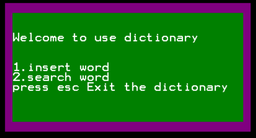
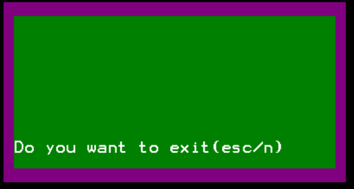
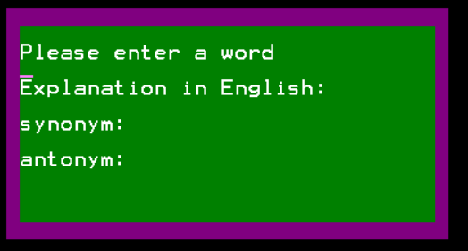
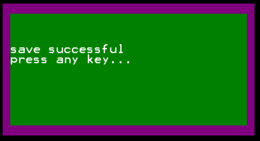
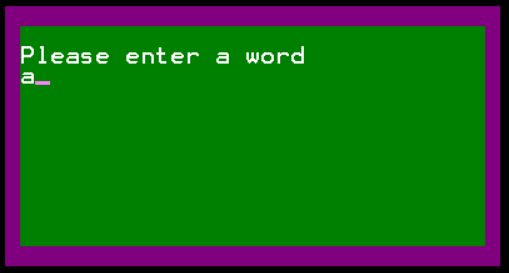
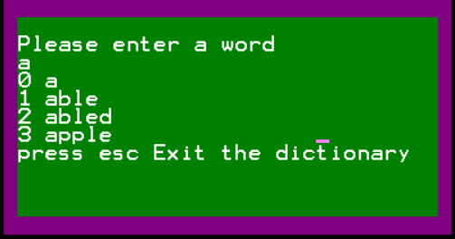
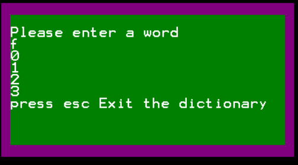
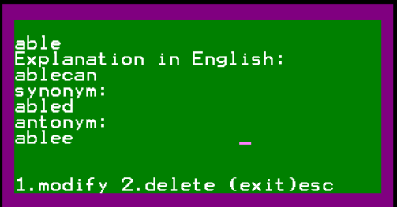

# Assembly-learning-research

## research 1-9 都是一些学习汇编的简单实验

## dictionary.asm是课程设计，简易英英字典，下面主要是介绍课程设计

### 设计思路和具体设定:
一个单词就是一条记录100b，包括单词的拼写字符串20b，英文解释40b（其实是30b因为一行就30b，我没有做换行处理，所以只能输出30b，多了就会超出框外），同义词20b，反义词20b，words.txt文件记录这些单词记录，而index.txt记录这些单词的索引，只记录单词的拼写20b和所在位置1b（所以这个系统最多可以插入256个单词，后期可以扩展，用一个字存），但是按照单词的顺序排列。找单词时就是所在位置1b*记录长度100b。index.txt第一个字节记录words里的单词数,words.txt中第一个字节记录当前写入位置

### 使用教程:

（如果第一次运行，先创建index.txt,words.txt文件和写入第一个字节0，就是把代码区的注释打开运行。但是要自己先插入单词记录，不然没有数据可查）
使用emu8086模拟，编译的时间有点长因为代码很长
直接点击run，会出现主界面

如主界面所示，有3个选项，输入1插入单词，输入2搜索单词（搜索单词后修改和删除），按esc退出程序
按一次Esc退出如下（其实只要按的不是1或者2都是退出） 

会重复确认用户是否要退出，再按一次esc就退出，否则按任意键回到主菜单界面

按1进入插入单词功能

依次输入单词，英文解释，同义词和反义词，（输入不要太快，可能程序反应不过来，而且输入错了不能使用backpace删除，只能esc先退出，但是输入完单词回车之后就已经写入文件，所以输入要小心一点，慢点）每输入完成一个就按回车enter输入下一个，也可以在输入过程中输入esc退出，注意输出完单词可能要等一会，因为在插入index.txt中。全部输入完之后就会出现保存的成功的提示，按任意键回到主菜单界面。

按2进入搜索单词功能

首先会提示你输入单词，可以输入不完整的字符串，模糊匹配，但是只能匹配前缀。当然也可以在输入过程按esc退回主菜单界面。同样，在输入单词完成之后按回车，会依顺序列出单词前缀和字符串相匹配的单词。如果找不到就什么也不显示

此时可以选择一个单词进行查看记录，可以按对应单词前的数字，当然也可以按esc退回主菜单界面。

按1修改
光标会闪动在英文解释下，可以直接覆盖写，写完按回车enter输入下一个，同义词和反义词同样，输入完会显示保存成功，按任意键回到主菜单界面。当然，也可以在输入的过程中按esc退出修改回到主菜单界面，但是不会保存。

按2删除，会将单词记录删除，最后也会显示保存成功，按任意键回到主菜单界面。

### 开发日志:

locate找单词的位置，buf中为记录的单词，先打开index.txt文件，02读写模式，先读入当前单词的数量记录在count变量中，然后pos记录的是当前的指针的位置（单词的位置），pos初始化为0，移动文件读写指针到pos位置，然后pos+1，然后读入pos位置的单词到stbuf变量中，然后对比逐字节buf和stbuf，如果等于则继续比较，如果buf某字节小于stbuf，则直接跳出，此时返回pos+1位置，buf有某字节大于buf或者pos==count即到了索引末尾或者stbuf和buf完全相等，此时pos即为单词要插入的值。

insert 输入单词之后调用locate找到要插入的位置pos，然后将pos之后的单词全部往后移一位，先读入单词的数量count，将读写指针移动到count-1的位置即最后一个单词，读入缓冲区stbuf，然后移动读写指针到count将stbuf写入，然后重复，直到count-1到pos，即移动次数为count-pos，用一个pos1来记录当前移动的单词的下标，从count-1到pos，小于pos就结束，每次将pos1位置的单词移动到pos1+1。

enquire 首先是查找单词，先输入一个单词，可以模糊查找，locate返回pos之后，通过pos1显示这个单词的后4个单词，如果后面没有4个单词，超过就只显示最多的单词，然后再输入一个数字选择看那个单词的记录，将pos和输入的位移相加就是要显示的单词的位置，移动文件读写指针指向，读出这个单词记录在words.txt的位置,将记录内容读出然后显示，看到了记录内容后，可以选择修改和删除记录，或者退出enquire功能。
修改单词就相当于重新输入英文解释和同义词和反义词。
删除单词，就是在index.txt将pos位置的单词删除，将count-1然后写回index.txt，words.txt中不变，但是已经默认删除的单词记录的位置已经是空了（结果就是删除会产生外部碎片，可以通过程序调整，但是时间不够了）。利用pos1辅助，pos1作为指针，将pos的值+1赋值给pos1，将pos1位置的单词读入缓冲区stbuf，然后将stbuf的内容写入pos1-1的位置，pos1从pos+1到count-1，pos1不小于count就结束。